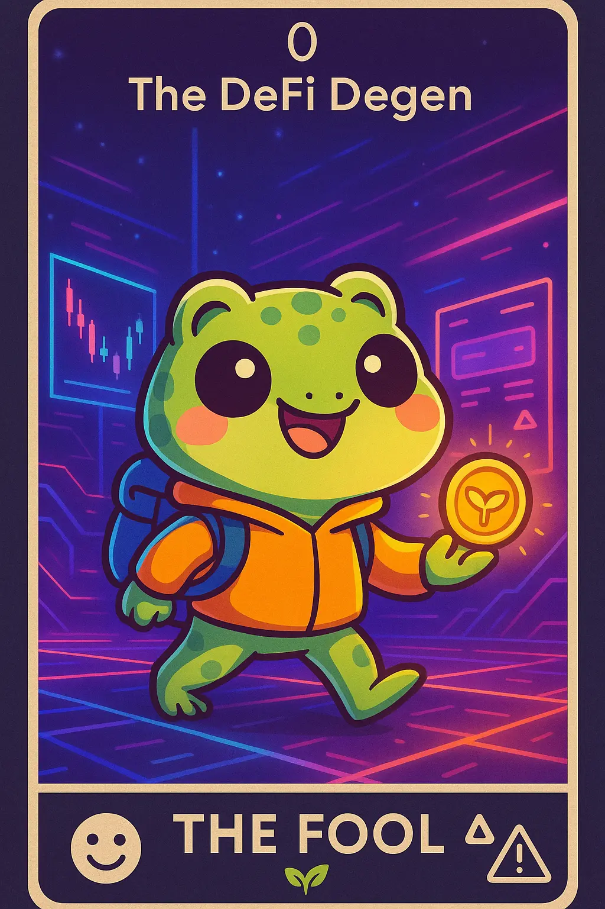

# 1. DeFi Degen: Crypto Carl

- *I embark on risky DeFi adventures with bold optimism and fearless exploration.* 

- ## tl;dr

    DeFi Degens chase the highest yields using high-risk strategies.

    * Fast movers, appear as rash to traditional finance folks.

    * Work with significant capital (often). 

    * Believe in anonymity and decentralization as core values. 

    * Willing to experiment and try new solutions to explore.

    * Provide early-stage projects the much needed liquidity and visibility.

    * Trailblazers in technology adoption, many upcoming Web3 technologies gain traction through them.

- ## Characteristics

    - High-risk tolerance, seeks highest yields
    - Active in liquidity mining and yield farming
    - First to try new protocols and products
    - Values anonymity and decentralization
    - Often operates with significant capital

- ## Behavior Patterns

    - Active 24/7 across multiple time zones
    - Shares alpha tips and farming strategies
    - Quick to move capital based on opportunities

- ## Pain Points

    - [Rug pulls](https://arxiv.org/pdf/2506.18398v3)
    - Impermanent loss
    - Gas fees, slower settlements

- ## Engagement Hooks

    - High-frequency trading
    - Complex DeFi strategies

- ## Primary Platforms

    - Twitter
    - Telegram alpha groups
    - Discord 
    - DeFi protocols 
    - DEXs (e.g., [Uniswap](https://uniswap.org/), [PancakeSwap](https://pancakeswap.finance/))
    - [Defillama](https://defillama.com)
    - MetaMask
    - Farcaster

- ## Tech Affinity

    Tech affinity section lists specific technologies, features, and solutions that are of interest to the
    DeFi Degen persona.

    - Integration support for EVM-compatible chains
    - Cross-chain interactions (bridges, protocols that enable seamless capital movement)
    - Flash loan and yield protocols ([Aave](https://aave.com), [Dydx](https://dydx.exchange))
    - Integration with technologies that reduce gas fees, faster settlements across chains enabling DeFi Degens to exploit yield opportunities across fragmented blockchain ecosystems.s

## How to Target?



-   :material-vector-difference: __DeFi Degen Mindset__

    ---

    * Embrace high-risk, speculative strategies in crypto trading and investing
    * Seen as pioneers in crypto and not gamblers
    * Thrive on short-term volatility rather than carefully evaluating long-term potential
    * Believers of rapid action, often without waiting for audits or security guarantees
    * Frequent disregard for conventional risk management
    * Believe in [go-big or go-home philosophy](https://spektrumlab.io/degen-culture-from-crypto-zero-to-moon-a-risk-takers-journey/)
    * Deeply involved in online communities

-   :material-brain: __DeFi Degen Motivation__

    ---

    * Excitement, social influence, eagerness to be the first and exploit opportunities early (to the moon!)
    * Yield farming, liquidity provision, and staking on new decentralized platforms
    * Leverage trading and perpetuals remains a popular tool for Degens chasing fast profits
    * Foster trust within the community by sharing wins, losses - transparent
    * Stay updated on hypes, trends, celebrity endorsements, Reddit threads

-   :material-rocket-launch: __DeFi Degen Must-Haves__

    ---

    * Privacy, decentralization
    * Complex trading bots that scrape for the slightest edge in newly listed tokens
    * New technology whitepapers and tokenomics that can give them an edge
    * Participation in professional courses and obtaining certificates of accomplishment
    * Ability to find information faster, stay updated via community conversations
    * They like asymmetric trades - tools that can help limit downside are gaining popularity

## Action Plan

* **Research & Refine:** Do your own research. Use this template to guide your design, documentation and product feature decisions. The lack of formal UX research reports in Web3 is a testament that this is an underexplored area where original research could provide significant competitive advantage.
* **Design Philosophy:** Mobile first design, speed over efficiency, comprehensive dashboards with risk alerts, concise and brief documentation, workflow notes.
* **Communication Style:** Engage with crypto native terminology, provide clear risk warnings. Focus on transparency, social proofs (audits) and community signals.
* **Product Features:** Identify relevant technology affinity areas applicable in the context and address must-haves. Ensure fast transaction flows, easy to use yield, APY and other benefit indicators, integrate social features that enable them to engage with the community and see what others are doing, utilizing for better results.

## See Also

* [Crypto Trader/Analyst](persona-3-crypto-trader.md)
* [Web3 Builder/Developer](persona-5-web3-builder.md)
* [ DeFi Guide](https://www.gemini.com/cryptopedia/what-is-defi-decentralized-finance)