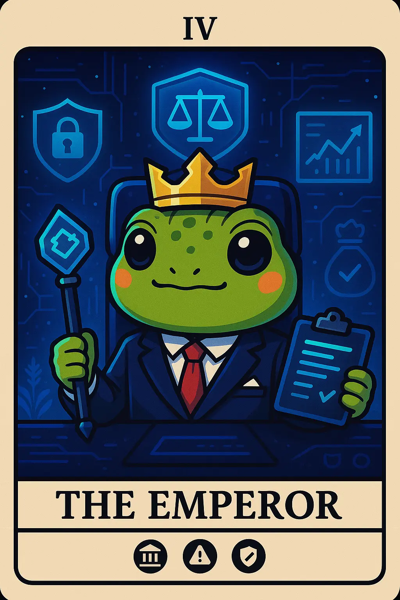

# 10. Institutional Investor: Token Tim

- *Ruling with structured authority and commanding vast financial resources* 
  

- ## tl;dr

    The Institutional/Professional Investor approaches crypto with a traditional finance perspective, focusing on compliance and large capital deployment.

    - Interested in Web3 technologies that offer efficiency, yield, and regulatory compliance at scale
    - Handles portfolio allocation, risk modeling, hedging against inflation, low correlation, slippage, and due diligence on products (ETF, ETPs, Funds)
    - Manages ongoing compliance with regulatory frameworks, securing against , vetting qualified counterparties and custodians
    - Executes direct institutional trading using specialized platforms (like CME Group) for high-volume derivatives trading to manage risk and provide liquidity (Example: CME Group commands [84.5% of BTC calendar futures open interest](https://www.cmegroup.com/articles/2025/mid-year-2025-cryptocurrency-insights-navigating-bitcoin-and-ether-markets.html))
    - Evaluates Crypto relative to portfolio objectives (store-of-value, diversification, Gen Z and alpha strategies), not in isolation
    - Expects pilot programs with integration into the back-office
    - Prefers medium-term allocation increases in Crypto instruments that offer a gradual adoption pathway
    - Motivated by asymmetric return potential of digital assets
    - Strong conviction in blockchain technology's long-term value, cautious but strategic approach rather than speculative
    - Shields low risk tolerance by starting with indirect exposure via VC funds backing blockchain builders

- ## Characteristics

    - Compliance and regulatory focused
    - Large capital deployment
    - Professional risk management
    - Traditional finance background

- ## Behavior Patterns

    - Evaluates crypto as an asset class
    - Participates in professional events
    - Engages with regulatory discussions
    - Seeks institutional-grade infrastructure
    - Deeply analyzes structure, fees, and underlying assets of registered investment vehicles

- ## Pain Points

    - Regulatory uncertainty and compliance
    - Lack of lack of mature, institutional-grade solutions for custody, security, insurance and governance
    - Liquidity access
    - Need for connecting crypto services with traditional finance infrastructure
    - Risk Management

- ## Engagement Hooks

    - Professional networking
    - Strategic positioning
    - Professional Discord servers
    - LinkedIn Institutional Investor forums
    - Specialized investment forums
    - Institutional Networks (GLG, AlphaSense, Third Bridge, Guidepoint)

- ## Primary Platforms

    - *Trading & Infrastructure:* Coinbase Prime, Kraken Institutional, TradingView for advanced charting
    - *Specialized DLT/Tokenization Platforms:* Private/Permissioned DLT networks, tokenization issuance platforms, and institutional-grade Layer 2 solutions
    - *Integrated Risk/Portfolio Management Software:* BlackRock's Aladdin
    - *Communication:* LinkedIn, Professional forums like WEF, Invest Web3 Forums, Specialized/Gated Discord/Telegram Servers

- ## Tech Affinity

    - *DID, KYC, AML Tools:* Integrating on-chain identity and compliance checks into a trading or lending protocol. Security, compliance and user control for dealing with regulatory risks related to cross-border transactions.
    - *Auditability & Transparency:* For reporting, tax, and compliance purposes. Regulatory compliance tools such as Chainalysis, Elliptic, compliance monitoring systems.
    - *TradeFi Integration:* Seamless integration into existing Treasury management systems, portfolio management software, and back-office operations used by traditional financial firms.
    - *Enterprise-grade SLAs & SSO / IAM:* Bank grade custody, insurance, role-based access, audit logs, multi-sig workflows and enterprise authentication.
    - *Stablecoins:* Yield generation, FX hedging, cash management, securities settlement, transactional convenience at lower costs.
    - *DeFI Protocols, Layer-1 Blockchains:* Staking, lending, derivatives, cross-border settlements, high TPS for enterprise volume, technologies that solve infrastructure gap for risk management.

## How to Target?

-   :material-vector-difference: __Institutional Investor Mindset__

    ---

    * *Risk-first, Compliance-centric Orientation:* Prefer regulatory vehicles for investments, risk averse with high appetite for calculated exposure. Prioritize regulatory compliance over potential returns, work with established, regulated entities, and demand clear legal framework before significant deployment of funds.
    * *Diversification-driven:* Asymmetric returns and hedging, low correlation portfolio spread, ability to address with GenZ and alpha client demands. Crypto is third category asset after private and public funds. Need to balance fiduciary duties with innovative investment opportunities.
    * *Strategic Patience, Operational Rigor:* Most hold positions awaiting optimal entry, with an eye towards [six-month allocations](https://www.sygnum.com/news/high-risk-appetite-and-long-term-confidence-drives-57-of-institutional-investors-to-raise-crypto-allocations-sygnum-future-finance-survey/). Decisions are routed through formal committees, due diligence processes, RFPs for vendors and SLA reviews.
    * *Vendor & Audit Conscious:* Trust is earned via audited processes (SOC reports), reputable counterparties, and institutional-grade transparency (wallet attestations, proof of reserves [where applicable](https://www.pwc.com/gx/en/industries/financial-services/assets/6th-annual-global-crypto-hedge-fund-report.pdf)).
    * *Innovation with Guardrails:* Attracted to digital assets as an "investment in innovative technology" but [demand](https://www.fidelitydigitalassets.com/sites/g/files/djuvja3256/files/acquiadam/June%202024%20Institutional%20Investors%20Digital%20Asset%20Survey%20-%20Key%20Findings%20%2805.29%29.pdf) that this innovation be wrapped in the security and structure of traditional finance (TradFi). Prefer traditional finance integration and value established relationships with traditional finance providers.

-   :material-brain: __Institutional Investor Motivation__

    ---

    * *Higher, Risk-adjusted Returns:* Generating alpha in low-yield environments. Interest in staking rewards and DeFi yield opportunities.
    * *Portfolio Diversification:* Low correlation of digital assets with traditional assets is a key factor. 
    * *New Revenue Streams:* New rails for cross-border settlement, exposure to fast-growing crypto markets opens new revenue lines for asset managers.
    * *Inflation/Store of Value:* Potential hedge against inflation pressures and currency devaluation.
    * *Client Demand:* Financial advisors, family offices and funds look at aligning with the preferences of younger generations (Millennials and Gen Z) who express high enthusiasm for digital asset.
    * *Arbitrage & Provisioning Liquidity:* Overall market efficiency via arbitrage opportunities and providing liquidity to the digital asset market.
    * *Asymmetric Return Potential:* Opportunity for outsized returns relative to traditional asset classes.
    * *Future-proofing & Innovation Leadership:* Staying relevant, positioning for future financial infrastructures, early adoption advantage in tokenization and digital asset markets.

-   :material-rocket-launch: __Institutional Investor Must-Have__

    ---

    * *Regulatory & Compliance:* KYC, AML integration, third-party audits
    * *Secure, institutional-grade custody:* Institutional-grade custody with multiple approval layers, cold storage, segregation of client assets, disaster recovery and clear insurance limits.
    * *On-chain Reporting:* For transparency and audits, risk management, automated compliance reporting and audit trails.
    * *Integration with TradFi:* ETPs, analytics, multi-asset platform (for both traditional and digital assets), professional-grade APIs and documentation. The platform must offer APIs and services that integrate into existing Treasury management systems, portfolio management software, and back-office operations used by traditional financial firms.
    * *Dedicated Support:* 24x7 support via assigned relationship managers, T=tailored products for specific institutional needs, comprehensive onboarding, education and training, detailed analytics and performance attribution. 
    * *Scalability/interoperability:* Layer-1 support for large deployments.

## Action Plan

* **Research & Refine:** Do your own research. Use this template to guide your design, documentation and product feature decisions. The lack of formal UX research reports in Web3 is a testament that this is an underexplored area where original research could provide significant competitive advantage.
* **Design Philosophy:** For transparency and explicability, UI must expose provenance, signer attestations and validations. Prioritize risk control with clear, well-labeled warnings, configurable limit orders, and comprehensive, real-time reporting dashboards that show regulatory status, counterparty risk, and portfolio volatility. Customizable dashboards that show consolidated exposures, compliance flags, audit trails, role-based access controls and multi-user workflows (committee approvals). Focus on Developer Experience (DX). Provide robust, high-performance APIs and documentation for seamless integration into existing financial infrastructure, minimizing the need for manual data entry or specialized Web3 knowledge. For CX, provide white-glove service with dedicated account managers who understand finance, rapid technical support, and consultative services on regulatory compliance and asset allocation.
* **Communication Style:** Institutional investors expect information density, detailed technical/legal whitepapers and third-party audit reports. Communication should be distributed through their preferred channels like specialized research reports, white papers, and webinars. Establish credibility by publishing original, high-quality research and reports with global financial institutions that can quantify risks and benefits. Do not use marketing hype but focus on using language like "governance framework," "institutional-grade custody," and "risk-adjusted returns." Share regular insights from industry thought leaders, timely regulatory updates.
* **Product Features:** Multi-Jurisdictional reporting with multi-monitor, granular, downloadable reports covering tax, accounting, and regulatory compliance across different jurisdictions. Built-in features for automated AML/KYC checks, configurable geo-fencing for cross-border operations, and mandatory transaction monitoring. Multi-sig vault controls. Offer regulated wrapper and integration services that provide exposure to digital assets without requiring the institution to handle the underlying assets directly. Provide modular integration with pluggable APIs for reporting, accounting systems, custody connectors, and compliance workflows (so institutions can integrate with internal systems). Provide region-specific legal and regulatory guidance. Real-time event notification systems, Webhooks integration, SDKs for custom integration, and sandbox environments for testing.

## See Also

* [Crypto Trader](persona-3-crypto-trader.md)
* [Regulation Navigator](persona-14-regulation-navigator.md)
* [Chainalysis - Geography of Crypto Report 2025](https://go.chainalysis.com/2025-geography-of-cryptocurrency-report.html)
* [PwC Crypto Hedge Fund Report Oct 2024](https://www.pwc.com/gx/en/industries/financial-services/assets/6th-annual-global-crypto-hedge-fund-report.pdf)
* [Coinbase Crypto Market Outlook 2024](https://www.coinbase.com/en-in/institutional/research-insights/research/market-intelligence/2024-crypto-market-outlook)
* [BIS Bulletin - Rise of tokenized money market funds](https://www.bis.org/publ/bisbull115.pdf)
