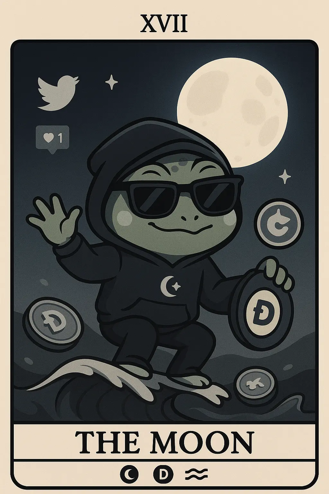

# 11. Meme Culturist: Meme Mervin

- *Surfing the illusive waves of meme magic under the mysterious crypto moonlight*
  

- ## tl;dr

    The Meme Culturist is playful, anti-establishment, driven by viral speculative trends,
    small speculative investments, and community sharing.

    - Voraciously consumes social narratives and gets influenced
    - Seeks dopamine high in instant decisive small bets in hopes of asymmetric gains
    - Risk averse, does not go deeper into investment fundamentals but by social proof
    - Looks for protection against token scams through real-time fraud alerts
    - Gives in to gamified UX, meme themes, community driven viral trends easily
    - Fixates on "psychological illusion of token accessibility" with low prices, ignoring over 80% loss rates

- ## Characteristics

    - Entertainment, humor and community culture focused
    - Speculative small investments
    - Rapid decision making driven by social media narratives
    - Believes in rebellion against norms, institutions
    - FOMO and trend following, interest waxes and wanes within a short span

- ## Behavior Patterns

    - Monitors real-time price and trends, influencer tips
    - Participates in meme coin launches, "pump" discussions
    - Shares crypto memes and culture, promotes sharing of narratives
    - Follows viral trends and challenges, latched onto influencer, seeks latest influencer
    - Engages in community celebrations (HODL posts, Profit Screenshots, Moon shots), gain parades, underlying humor, irony, and rebellious spirit

- ## Pain Points

    - Pump and dump schemes
    - Emotional investing
    - Lack of fundamentals
    - Web3 interface and technology complexity

- ## Engagement Hooks

    - High social activity
    - Entertainment focused
    - Gamified trading
    - Social proof, intermittent variable rewards

- ## Primary Platforms 

    - Twitter/X
    - Reddit [r/CryptoCurrency](https://www.reddit.com/r/CryptoCurrency/)
    - Telegram meme channels
    - Discord
    - TikTok

- ## Tech Affinity.

    - *Layer 2, Layer 3 Scaling:* These solutions enable faster transactions and lower gas fees, which is critical for high-frequency, low-value speculative trading.
    - *Decentralized exchanges & one-click swap UIs :* Example: Uniswap, PancakeSwap, 1-inch, aggregator UIs. These enable instant access to meme token listings, low friction for small, speculative trades, and token sniping.
    - *Social Sentiment Analysis, Memetic Amplification Tools:* Example: LunarCrush, Santiment, CryptoMood. These tools enable quick discovery and community coordination for launches, memes and FOMO spread for shaping community behavior with aspirational early mover advantage. Integration with social bots for instant notifications, community coordination, viral content distribution. 
    - *Meme Creation & Sharing Tool Integration:* Integral to Meme culturist. Integrate with social channels as well as tools such as Imgflip, Canva, GIF tools, other popular meme generators.
    - *On-chain analytics & token-sniffers:* Quick sanity checks (tokenomics, owner wallets, liquidity locks). Tools that show liquidity lock status, contract ownership and [rug-pull risks](https://www.sciencedirect.com/science/article/pii/S2096720925000636) to mitigate scams. Real-time fraud detection ensures safety while allowing them to continue small investment but high-risk trading.
    - *Low-friction Fiat on-ramp, custodial simple mobile wallets:* Enable quick onboarding, small bets from mainstream users, lowers barrier for entertainment and fun driven spends.
    - *Community Rewards, Gamified Engagement, Leaderboards:* Amplifies virality, encourages sharing, social proof, community incentive driven growth, desire for a dopamine reward loop similar to gambling.

## How to Target?

-   :material-vector-difference: __Meme Culturist Mindset__

    ---

    * Entertainment first, fundamentals later investment philosophy
    * "To the moon" optimism and moonshot overconfidence, makes high-risk, high-reward small stake bets
    * Herd mentality and community solidarity, prone to group-think, echo-chamber effect
    * Playful, irreverant, rebellious, anti-establishment and decentralization ethos, challenges established norms
    * Prioritizes speed over deep analysis, rapid decision making based on crowd signals
    * Masculinity-asserting, uses risk-taking in memes to display "fortitude and independence," especially young men ([72% ownership rate](https://journals.sagepub.com/doi/full/10.1177/15365042231172460)).
    * FOMO driven, trusts influencers and acts decisively with a short term focus, small attention span

-   :material-brain: __Meme Culturist Motivation__

    ---

    * *Quick, Life-changing Gains:* Hope of outsized returns from viral pumps.
    * *Community Fandom, Belonging:* Social capital and clout, prospects of bragging rights for spotting / sharing viral tokens or memes. Community celebration mechanics and social media dynamics [support this](https://public.bnbstatic.com/static/files/research/understanding-the-rise-of-memecoins.pdf).
    * *Entertainment, Dopamine Hits:* Meme culture is recreational; participation is as much social entertainment as investment.
    * *Accessibility, Low Barrier to Tokens:* Billions of tokens for pennies, enabling ["narrative power" over fundamentals](https://www.ainvest.com/news/meme-coin-mania-2025-investor-psychology-market-sentiment-driving-bull-run-2509). Playground for retail experimentation, trying new projects, tokens, on-chain games, as a hobbyist pursuit.
    * *Asserting Independence:* Rebelling against norms, institutions, established practices.

-   :material-rocket-launch: __Meme Culturist Must-Have__

    ---

    * *Gamified, Community UX:* Low UX friction intuitive interfaces for hype surfing with meme visuals to engage playful mindset, meme contests, airdrops, leaderboard badges, referral GIFs/stickers, tweet/telegram share buttons built in, features that amplify community sharing and retention. Mobile support with one hand quick access ability.
    * *Safety Signals:* Rug-pull, honeypot detectors that flag risk, liquidity lock indicators, contract owner visibility, loss limits, contract verification that protects small, frequent bets and reduces scam risks.
    * *Instant, Low cost Transactions:* Speed and simplicity with low gas fee, fast DEX access for rapid, decisive, sentiment-driven low-cap trades, fast swaps, small minimums. 
    * *Hot lists, Narrative Trackers:* Real-time trends and volatility alerts, social momentum indicators, sentiment sleuths, and whale analytics to manage FOMO.
    * *Social sharing, Virality hooks:* Native social integration for trend alerts, influencer tracking, sharing and driving sentiment impact.

## Action Plan

* **Research & Refine:** Do your own research. Use this template to guide your design, documentation and product feature decisions. The lack of formal UX research reports in Web3 is a testament that this is an underexplored area where original research could provide significant competitive advantage.
* **Design Philosophy:** Speed and delight first with meme-forward aesthetics. Lean towards playful, colorful, meme-inspired design elements. Meet instant gratification mindset with quick actions and instant visual feedback. Provide badges, visual rewards (like confetti for a major gain), gamified interfaces to signal achievements and sharing, easy screenshot sharing with built-in branding, easy use on mobile with one thumb navigation and single-handed use. For DX, allow community developers to easily build tools, bots, and analytics on top of the platform. Enable social integration, tools for meme creation, automation with trading bots, build real-time price notifications via webhooks. Focus on a welcoming design environment for newcomers to the community.
* **Communication Style:** Leverage primary social channels (Twitter, Discord, Telegram, TikTok, Reddit). Use memes as the predominant communication vehicle for the target audience. Tie in the product or service's value proposition directly to current viral internet and crypto trends. Frame the product as a tool or an enabler for the community, built by the community. This empowers the target audience against "whales" or "traditional finance," appealing to their rebellious mindset. Emphasize urgency and limited opportunities to appeal the FOMO mindset, highlight big wins for community members, feature key user generated content and stories, use cheeky, impudent tone that is humorous, anti-establishment and casual. Engage with frequent, viral community challenges and competitions to cater to frequent small win mentality.
* **Product Features:** Must have three key types of product features related to meme trading, social and security with focus on business critical narrative tracking features. For example, trending meme dashboards, fast in-and-out trade capabilities, influencer alert systems, community sentiment meter, quick swap interface, memecoin calendar, raid (community buy events) coordination, trophy room and community challenges. For safety add community warning systems, rug-pull scanners, loss prevention nudges, educational safety information delivered via memes, "play money" paper trading mode for practice. Also, optimize for single-coin focused discussions, support specific coin communities to leverage viral content creation patterns. Cross-community and blockchain interactions are an added plus.

## See Also

* [Crypto Influencer](persona-6-influencer.md) 
* [NFT Collector](persona-2-nft-collector.md) for community culture.
* [Memecoin: Only profitable sector in 2025]https://nftevening.com/meme-is-the-only-profitable-crypto-sector-in-2025/
* [Dynamics between Bitcoin markt trends and social media activity](https://www.mdpi.com/2674-1032/3/3/20)
