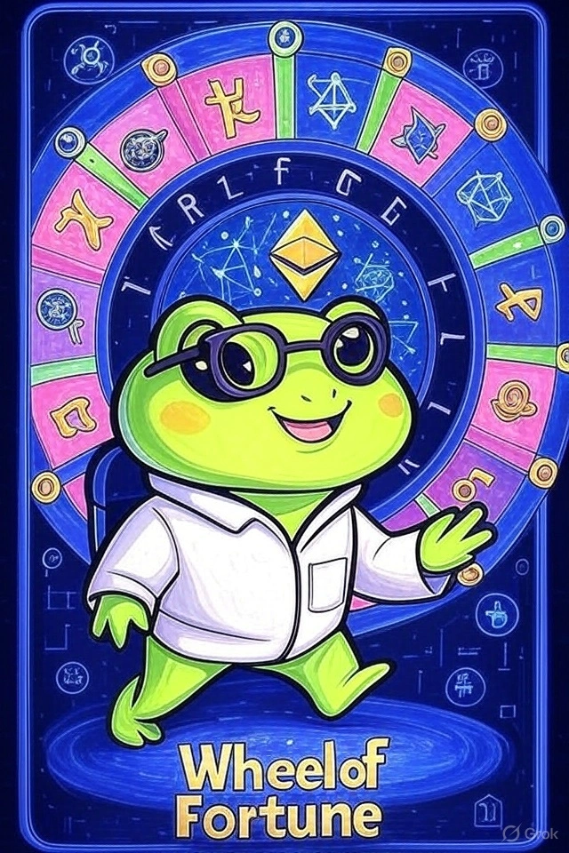

# 13. AI + Crypto Wiz: Shakey Asimotoshi

- *Spinning the algorithmic wheel where artificial intelligence meets decentralized fortune*
  
  
- ## tl;dr

    The AI + Crypto Hybrid User leverages AI and blockchain for innovative trading and analytics.

- ## Characteristics

    - Intersection of AI and blockchain technology
    - Participates in AI-powered trading and analytics
    - Engages with AI-generated content and NFTs

- ## Behavior Patterns

    - Uses AI for trading strategies
    - Contributes to AI-blockchain projects
    - Explores AI-generated NFT markets
    - Participates in tech-focused communities

- ## Pain Points

    - Data privacy concerns
    - Technical complexity
    - Integration challenges

- ## Engagement Hooks

    - Tech-driven
    - Experimental focus

- ## Primary Platforms

    - AI-powered trading platform
    - Discord dev channels
    - Twitter/X

- ## Tech Affinity

    Tech affinity section lists specific technologies, features, and solutions that are of interest to the
    AI + Crypto Wiz persona.

    - ddd

## How to Target?

-   :material-vector-difference: __AI + Crypto Wiz Mindset__

    ---

    * ddd
    * ddd

-   :material-brain: __AI + Crypto Wiz Motivation__

    ---

    * ddd
    * ddd

-   :material-rocket-launch: __AI + Crypto Wiz Must-Have__

    ---

    * ddd
    * ddd

## Action Plan

* **Research & Refine:** Do your own research. Use this template to guide your design, documentation and product feature decisions. The lack of formal UX research reports in Web3 is a testament that this is an underexplored area where original research could provide significant competitive advantage.
* **Design Philosophy:** ddd
* **Communication Style:** ddd.
* **Product Features:** ddd.

## See Also

* [Web3 Builder](persona-5-web3-builder.md)
* [NFT Collector](persona-2-nft-collector.md)
* [ScienceDirect](https://www.sciencedirect.com/science/article/pii/S2096720923000255)
