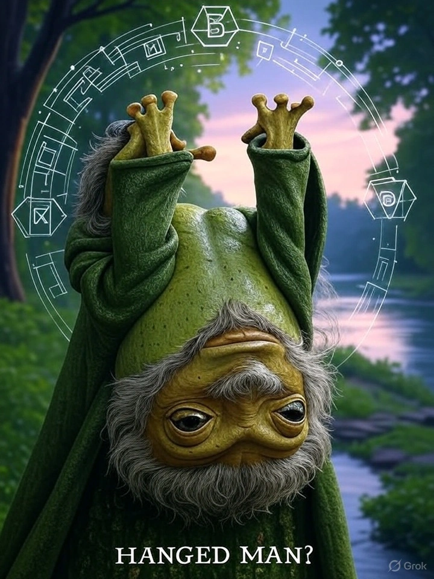

# 15. Sustainability Stalwart: Sustainer Suzy

- *Hanging in mindful suspension, seeing crypto's environmental impact from a new perspective*
  

- ## tl;dr

    The Sustainability Advocate promotes eco-friendly blockchain practices and proof-of-stake initiatives.

- ## Characteristics

    - Environmental conscious crypto participation
    - Supports proof-of-stake and green blockchain initiatives
    - Promotes sustainable crypto practices

- ## Behavior Patterns

    - Advocates for low-energy blockchains
    - Participates in sustainability discussions
    - Supports green crypto projects
    - Educates on environmental impact

- ## Pain Points

    - Energy consumption concerns
    - Limited green blockchain adoption
    - Public perception of crypto’s environmental impact

- ## Engagement

    - Advocacy-driven
    - Community-focused

- ## Primary Platforms

    - Green blockchain forums
    - Twitter/X
    - Discord sustainability channels

- ## Tech Affinity

    Tech affinity section lists specific technologies, features, and solutions that are of interest to the
    Sustainability Stalwart persona.

    - ddd

## How to Target?

-   :material-vector-difference: __Sustainability Stalwart Mindset__

    ---

    * ddd
    * ddd

-   :material-brain: __Sustainability Stalwart Motivation__

    ---

    * ddd
    * ddd

-   :material-rocket-launch: __Sustainability Stalwart Must-Have__

    ---

    * ddd
    * ddd

## Action Plan

* **Research & Refine:** Do your own research. Use this template to guide your design, documentation and product feature decisions. The lack of formal UX research reports in Web3 is a testament that this is an underexplored area where original research could provide significant competitive advantage.
* **Design Philosophy:** ddd
* **Communication Style:** ddd.
* **Product Features:** ddd.

## See Also

* [Anonymity Advocate](persona-12-privacy-advocate.md)
* [Web3 Builder](persona-5-web3-builder.md)
* [ResearchGate](https://www.researchgate.net/publication/374254829_Tokenomics_in_Web3_A_Strategic_Framework_for_Sustainable_and_Scalable_Blockchain_Ecosystems)
* [Tokenomics for Sustainable Chains](https://www.researchgate.net/publication/390936830_Tokenomics_in_Web3_A_Strategic_Framework_for_Sustainable_and_Scalable_Blockchain_Ecosystems)