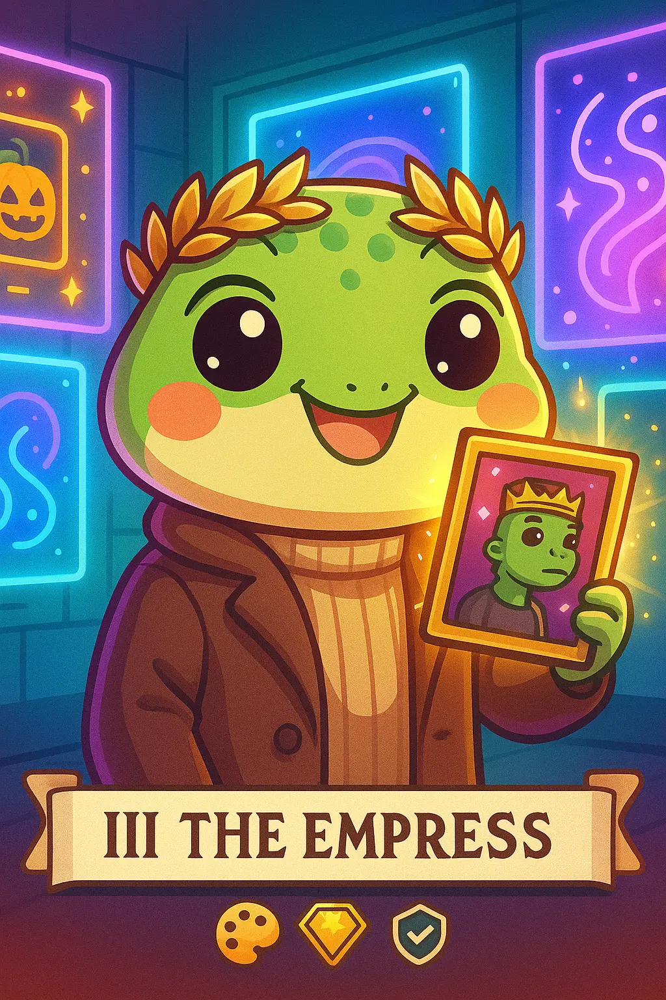

# 2. NFT Collector: Flipper Finn
---
*Creating and collecting digital beauty with refined taste and cultural influence*

||
| -:-|
||
||

## Overview

The NFT Collector/Flipper blends art appreciation with speculation, engaging in community-driven decisions and status-conscious collecting.

## Characteristics

- Art appreciation mixed with speculation
- Community-driven decision making
- Status-conscious (profile pictures, rare pieces)
- Trend-aware and culturally engaged

## Behavior Patterns

- Participates in whitelist competitions
- Active in project Discord servers
- Follows influencer recommendations
- Engages in collection roadmap discussions

## Pain Points

- Market volatility
- Fake projects
- Royalty disputes

## Engagement

- Medium to high spending
- Community participation

## Primary Platforms

- Discord (project servers)
- Twitter/X, [OpenSea](https://opensea.io/)
- [Blur](https://blur.io/)

## See Also

* [Gaming/Metaverse Enthusiast](persona-7-gaming-enthusiast.md)
* [Crypto Influencer](persona-6-influencer.md) 
* [Cointelegraph’s NFT Guide](https://cointelegraph.com/explained/what-are-non-fungible-tokens-nfts)
* [Decentralized Internet](https://cointelegraph.com/learn/what-is-web-3-0-a-beginners-guide-to-the-decentralized-internet-of-the-future)
