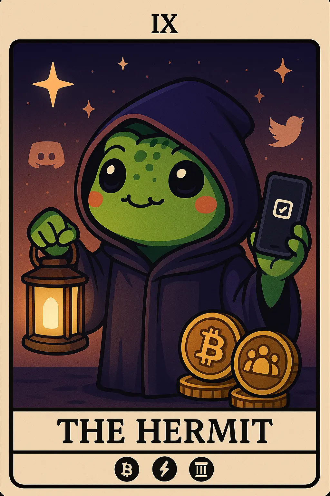

# 4. Long-term Investor: HODL Harold

- *Walking the solitary path of patience and wisdom, holding the light of long-term vision*
  

- ## tl;dr

    The Hodler/Long-term Investor focuses on fundamental analysis and long-term crypto investment.

    - Embodies resilience and conviction in blockchain's future
    - Holds deep belief in decentralization, financial sovereignty, and crypto's potential to
      disrupt traditional systems
    - Seeks yields and true ownership, non-custodial designs for interacting with Web3 systems
    - Prioritizes patience over panic, views volatility as noise rather than signal,
      often draw from behavioral finance principles like loss aversion to avoid emotional trades
    - Pain points include extreme price swings that erode confidence, security threats (hacks, lost keys)
      risk irrecoverable losses, regulatory uncertainty stifles planning, and the need for constant
      vigilance due to complexity of self-custody demands.

    [Tech Affinity](#tech-affinity){ .md-button }
    
    [Targeting Method](#how-to-target){ .md-button }

- ## Characteristics

    - Long-term perspective (years to decades)
    - Fundamental analysis focused
    - Lower frequency engagement
    - Dollar-cost averaging strategies

- ## Behavior Patterns

    - Accumulates during market downturns
    - Participates in staking and governance
    - Shares educational content
    - Promotes adoption narratives

- ## Pain Points

    - Short-term volatility
    - Regulatory threats
    - Security concerns

- ## Engagement Hooks

    - Low-frequency but impactful interactions
    - Consistent educational focus

- ## Primary Platforms

    - Reddit ([r/CryptoCurrency](https://www.reddit.com/r/CryptoCurrency/))\
    - Bitcoin forums
    - CEXs
    - Hardware wallet communities

- ## Tech Affinity

    Tech affinity section lists specific technologies, features, and solutions that are of interest to the
    Web3 HODLer/long-term investor persona.

    - Multi-sig, secure systems that address complexity and speed demands
    - Infrastructure and enterprise-level robust, scalable and reliable solutions
    - Low-Latency APIs for CEX/DEX Integration
    - Support for trading bots to enable customized automated strategies (arbitrage, market making,
      trend following) catering to their analytical skills
    - Multi-chain order book systems like [dydx](https://dydx.trade/) that
      enable centralized exchange-like speed with decentralized trust, providing
      a familiar trading environment for advanced traders, supporting perpetuals and leverage trading critical to their speculative strategies
    - DeFi management protocols with strong fundamentals (Restaking, Asset Management, RWA, Lending, Borrowing,Derivatives)
    - Layer1/2 scaling solutions
    - Ability to manage portfolios across multiple protocols, cross-chain asset management
    - Re-balancing assets and capital efficiencies
    - Ability to leverage service composability and access diverse assets and liquidity pools with precision
      using advanced data-driven strategies
    - Built-in mixers/ZK proofs for transaction obfuscation; real-time phishing detection and dApp risk scoring

## How to Target?

-   :material-vector-difference: __Long-term Investor Mindset__

    ---

    * HODLers are typically sophisticated investors who understand both traditional finance and blockchain technology fundamentals
    * Long term value accrual through protocol participation
    * Focus on sustainable yield generation through lock-up yields that pay interest for immobilizing digital assets in pools, serving as liquidity or collateral rather than speculative day trading
    * Crypto protocol evolution participant rather than a passive token holder

-   :material-brain: __Long-term Investor Motivation__

    ---

    * Motivated by having direct control over protocol evolution through governance, voting
    * Look for earning rewards through liquidity mining that pays interest via tokens issued by the DeFi service 
    * Interest in Bitcoin as a digital gold store of value & hedge against inflation
    * Survival through cycles mentality is a big motivation

-   :material-rocket-launch: __Long-term Investor Must-Have__

    ---

    * Robust security and privacy features, scam alerts, data driven dashboards and macro-economic reports
    * Staking and yield automation, portfolio analytics and tax reporting
    * Multi-chain abstraction and gas optimization for seamless scalability, reduced UX friction, errors and latency helping faster settlements
    * Community and governance integration

## Action Plan

* **Research & Refine:** Do your own research. Use this template to guide your design, documentation and product feature decisions. The lack of formal UX research reports in Web3 is a testament that this is an underexplored area where original research could provide significant competitive advantage.
* **Design Philosophy:** Intuitive, non-custodial interfaces, futuristic yet accessible aesthetics, privacy focused and secure visuals emphasizing user control without confusing jargon, social recovery and DAO participation ease.
* **Communication Style:** Respect their expertise, save the time, fact and data driven communication approach, educational rather than promotional style, multi-format content delivery, in-depth and highlight long term value proposition, align with favorable content channels and timing, long form research reports from favored channels such as Messari, Ethereum research, the Block, academic papers, smart contract audit reports, architectural whitepapers, tokenomics documentation, protocol sustainability models, governance roadmap.
* **Product Features:** AI powered folio analytics, real-time risk assessment tools, integration enabling holding of tokenized RWA, privacy preserving transaction ability, one-tap voting and forums tied to holdings, fostering engagement and shared decision-making for long-term ecosystem alignment.

## See Also

* [Crypto Newcomer](persona-9-newcomer.md)
* [Institutional Investor](persona-10-institutional-investor.md)
* [Bitcoin Design](https://bitcoin.design)
* [Q1 2024 Rootdata Web3 industry investment research report](https://www.chaincatcher.com/en/article/2122332)
* [Long term HODLing strategies for 2025](https://www.tokenmetrics.com/blog/crypto-hodl-the-long-term-investment-strategy-for-building-wealth-in-2025)
* [The 2025 Global Adoption Index](https://www.chainalysis.com/blog/2025-global-crypto-adoption-index/)
* [Messari Crypto Theses 2024](https://resources.messari.io/pdf/crypto-theses-for-2024.pdf)
