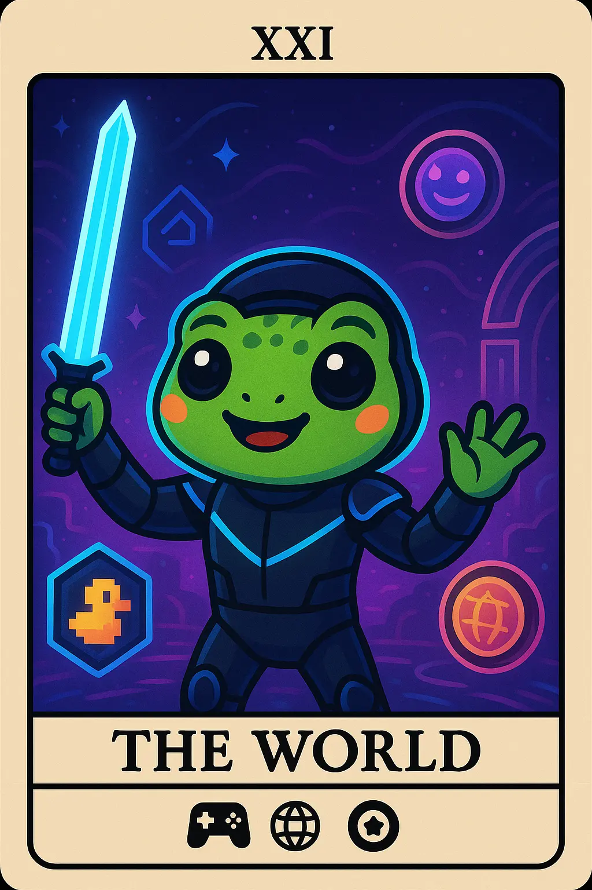

# 7. Gaming Enthusiast: Metaverse Mia

- *Dancing in virtual realms, achieving completion through play and digital exploration*
  

- ## tl;dr

    The Gaming/Metaverse Enthusiast focuses on play-to-earn games and virtual world participation.

- ## Characteristics

    - Play-to-earn and GameFi focused
    - Virtual world and avatar culture participation
    - In-game asset trading and collecting
    - Community guild participation

- ## Behavior Patterns

    - Daily gaming sessions with earning objectives
    - Active in guild coordination and strategy
    - Trades gaming NFTs and tokens
    - Participates in virtual events

- ## Pain Points

    - Game sustainability
    - Token inflation
    - Time investment vs. returns

- ## Engagement Hooks

    - High time investment
    - Social gaming focus

- ## Primary Platforms

    - Discord gaming servers
    - Metaverse platforms (e.g., [Decentraland](https://decentraland.org/))
    - NFT marketplaces

- ## Tech Affinity

    Tech affinity section lists specific technologies, features, and solutions that are of interest to the
    Web3 Gaming Enthusiast persona.

    - ddd

## How to Target?

-   :material-vector-difference: __Gaming Enthusiast Mindset__

    ---

    * ddd
    * ddd

-   :material-brain: __Gaming Enthusiast Motivation__

    ---

    * ddd
    * ddd

-   :material-rocket-launch: __Gaming Enthusiast Must-Have__

    ---

    * ddd
    * ddd

## Action Plan

* **Research & Refine:** Do your own research. Use this template to guide your design, documentation and product feature decisions. The lack of formal UX research reports in Web3 is a testament that this is an underexplored area where original research could provide significant competitive advantage.
* **Design Philosophy:** ddd
* **Communication Style:** ddd.
* **Product Features:** ddd.

## See Also

* [NFT Collector](persona-2-nft-collector.md)
* [DAO Contributor](persona-8-dao-contributor.md) 
* [Web3 gaming](https://playtoearn.com/news/how-decentralized-autonomous-organizations-daos-foster-player-empowerment-in-web3-games)
