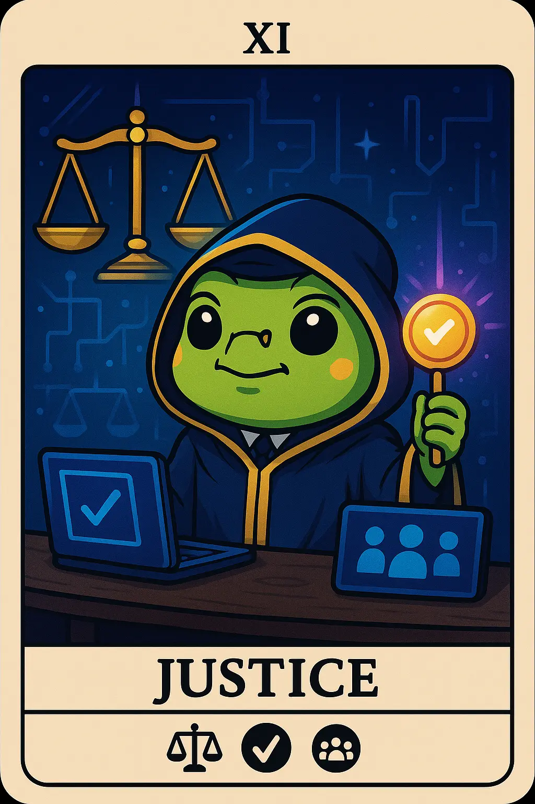

# 8. DAO Contributor: DAO Dave

- *Balancing community needs with careful deliberation and fair governance* 
  

- ## Overview

    The DAO Contributor/Governance Participant actively participates in decentralized organization decision-making.

- ## Characteristics

    - Decentralized organization participation
    - Governance token holding and voting
    - Proposal creation and discussion
    - Community decision-making involvement

- ## Behavior Patterns

    - Regular voting on proposals
    - Participates in governance discussions
    - Contributes to DAO operations
    - Advocates for protocol improvements

- ## Pain Points

    - Voter apathy
    - Complex governance systems
    - Token concentration

- ## Engagement

    - Moderate to high
    - Focused on specific DAOs

- ## Primary Platforms

    - Discord governance channels
    - [Snapshot](https://snapshot.org/)
    - On-chain governance platforms

- ## Tech Affinity

    Tech affinity section lists specific technologies, features, and solutions that are of interest to the
    DAO Contributor persona.

    - ddd

## How to Target?

-   :material-vector-difference: __DAO Contributor Mindset__

    ---

    * ddd
    * ddd

-   :material-brain: __DAO Contributor Motivation__

    ---

    * ddd
    * ddd

-   :material-rocket-launch: __DAO Contributor Must-Have__

    ---

    * ddd
    * ddd

## Action Plan

* **Research & Refine:** Do your own research. Use this template to guide your design, documentation and product feature decisions. The lack of formal UX research reports in Web3 is a testament that this is an underexplored area where original research could provide significant competitive advantage.
* **Design Philosophy:** ddd
* **Communication Style:** ddd.
* **Product Features:** ddd.

## See Also

* [Web3 Builder](persona-5-web3-builder.md)
* [Gaming Enthusiast](persona-7-gaming-enthusiast.md)
* [DAOs in Web3](https://101blockchains.com/importance-of-daos-in-web3/)